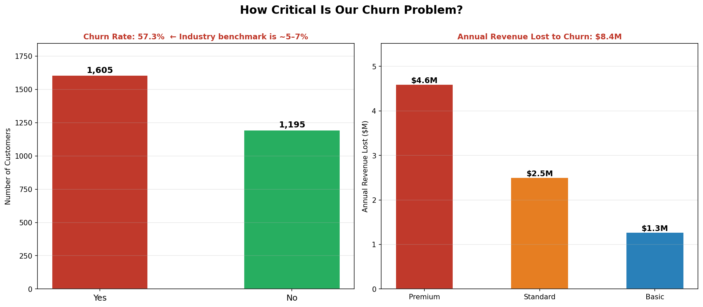
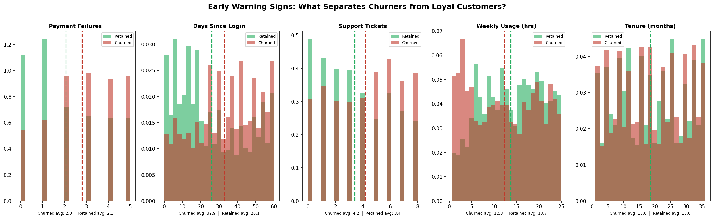
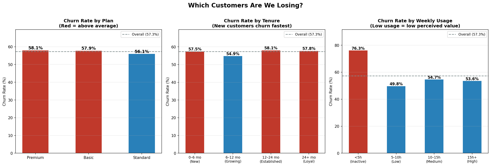
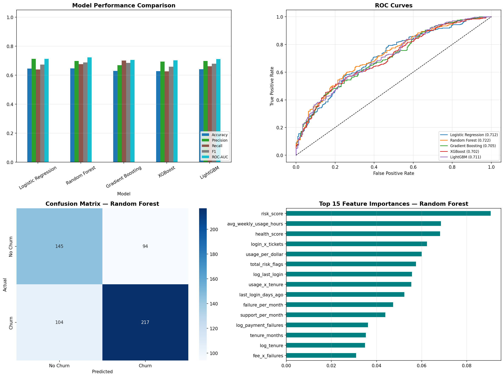

# Customer Churn Prediction


> An end-to-end machine learning system that identifies subscribers at risk of cancelling — and translates every prediction into a specific business action with an estimated cost and revenue impact.

---

## Results at a Glance

| | |
|---|---|
| Annual revenue at risk identified | **$7.9M** |
| High-risk customers flagged | **1,221 of 2,800** |
| Model ROC-AUC | **0.722** |
| Churners caught (Recall) | **68%** |
| Projected net ROI from interventions | **~$2.05M / year** |

---

## The Problem

A subscription business with **2,800 customers** has a **57.3% annual churn rate** — more than 10× the industry benchmark of ~5%. At an average customer value of $5,211/year, that is **$8.4M walking out the door every year**.

The goal: predict who is about to cancel *before* they do, so the retention team can act in time.



---

## What Drives Churn?

Exploratory analysis identified four measurable early warning signs:

| Warning Sign | Churned Avg | Retained Avg | Gap |
|---|---|---|---|
| Payment failures | 2.8 | 2.1 | **+0.7** |
| Days since last login | 32.9 | 26.1 | **+6.7** |
| Support tickets | 4.2 | 3.4 | **+0.8** |
| Weekly usage (hrs) | 12.3 | 13.7 | **−1.5** |



The pattern is clear: customers disengage weeks before they cancel. The model turns these signals into an early warning system.

---

## Which Segments Are Most at Risk?



Key findings:
- **New customers (0–6 months)** churn at the highest rate — they haven't formed habits yet
- **Low-usage customers (<5h/week)** churn at 76% — they see no value in the product
- All three plan tiers churn above the industry average, meaning this is a retention problem, not a pricing one

---

## Approach

### Feature Engineering (29 features from 9 raw inputs)

Rather than feeding raw numbers into the model, each feature was designed to capture a specific business signal:

| Feature Group | Business Signal |
|---|---|
| Payment failures + rate per month | Financial friction — #1 early warning sign |
| Days since login + inactivity flag | Disengagement precedes cancellation by 2–4 weeks |
| Support tickets + rate per month | Unresolved issues erode trust |
| Usage hours + low-usage flag | Low usage = low perceived value |
| Tenure bucket + log transform | New customers churn fastest; log compresses long tail |
| Risk score, health score | Composite KPIs combining multiple signals |
| Interaction terms (e.g. login × tickets) | Some risks multiply — inactive AND frustrated = critical |

### Why These Models?

Five models were tested and compared:

| Model | Why tested |
|---|---|
| Logistic Regression | Baseline — sets the performance floor |
| Random Forest | Gives feature importance — tells us *which* factors drive churn |
| Gradient Boosting | Strong on tabular data with mixed feature types |
| XGBoost | Handles class imbalance natively via `scale_pos_weight` |
| LightGBM | Fastest to retrain — important for monthly retraining cycles |

### Why Recall over Accuracy?

Missing a churner costs **$5,211/year**. A false alarm costs **$50** (one outreach call).

That 100× cost asymmetry means catching more churners — even at the cost of some false alarms — is always the right business decision. Recall and ROC-AUC were used as the primary metrics.

> **Note on accuracy:** The dataset has a 57% churn rate (nearly balanced), so a 64.6% accuracy model is meaningfully beating the baseline. The ROC-AUC of 0.722 means the model correctly ranks a real churner above a non-churner 72% of the time.

---

## Model Results



| Model | Accuracy | Recall | ROC-AUC | CV-AUC |
|---|---|---|---|---|
| **Random Forest ✓** | **64.6%** | **67.6%** | **0.722** | **0.707** |
| Logistic Regression | 64.5% | 63.9% | 0.712 | 0.719 |
| LightGBM | 64.1% | 67.8% | 0.711 | 0.685 |
| Gradient Boosting | 62.9% | 70.1% | 0.705 | 0.701 |
| XGBoost | 62.7% | 62.6% | 0.702 | 0.688 |

Random Forest was selected for highest ROC-AUC and for its interpretability — feature importances tell the business team *which* metrics to monitor and act on.

---

## Business Output

Every prediction is translated into an action with a cost and revenue estimate:

```
🔴  User 9001  |  Plan: Premium  |  Churn probability: 98.3%  |  Risk: High
     Annual value : $8,388  |  Revenue at risk: $8,245
     Action       : [HIGH] Personal outreach + retention offer  (est. cost: $300)
       → Inactive 30+ days — send re-engagement campaign immediately
       → 3+ payment failures — offer payment plan or billing support
       → 5+ support tickets — assign dedicated support contact

🟢  User 9002  |  Plan: Standard  |  Churn probability: 8.6%  |  Risk: Low
     Annual value : $4,788  |  Revenue at risk: $413
     Action       : [LOW] Standard engagement  (est. cost: $0)
```

### Portfolio Risk Summary (full dataset)

| Risk Tier | Customers | Revenue at Risk | Recommended Action |
|---|---|---|---|
| 🔴 High (>60%) | 1,221 (43.6%) | $4.99M | Personal outreach + retention offer ($300/customer) |
| 🟡 Medium (30–60%) | 1,033 (36.9%) | $2.36M | Automated nurture + check-in call ($50/customer) |
| 🟢 Low (<30%) | 546 (19.5%) | $574K | Standard engagement ($0 extra) |

### Projected Annual ROI

| | |
|---|---|
| Churners identified by model | ~1,091 / year |
| Retained at 40% save rate | ~436 / year |
| Revenue protected | ~$2.27M |
| Campaign cost | ~$218K |
| **Net ROI** | **~$2.05M** |

---

## Project Structure

```
├── features.py       — Feature engineering (single source of truth for train + predict)
├── eda.py            — Exploratory data analysis, generates 4 business-question charts
├── train.py          — Model training pipeline with full business narrative output
├── predict.py        — Inference: scores customers, outputs revenue at risk + actions
├── requirements.txt  — Dependencies
├── plots/            — Charts (generated by eda.py and train.py)
└── models/           — Trained model artifacts (generated by train.py)
```

## How to Run

```bash
pip install -r requirements.txt

python3 eda.py      # explore the data → saves charts to plots/
python3 train.py    # train the model  → saves model to models/
python3 predict.py  # score customers  → prints risk report
```

---

## Skills Demonstrated

| Area | Detail |
|---|---|
| **Feature engineering** | 29 features from 9 inputs: ratios, log transforms, interaction terms, composite risk scores |
| **Model selection** | Compared 5 algorithms; justified choice on business criteria, not just accuracy |
| **Imbalanced data** | Class weighting (`class_weight='balanced'`, `scale_pos_weight`), Recall-focused metric selection |
| **Validation** | Stratified 5-fold cross-validation to prevent overfitting |
| **Business translation** | Every model output mapped to a revenue figure and a specific intervention |
| **Code quality** | DRY architecture — feature engineering in one shared module, no duplication |
| **Libraries** | pandas, numpy, scikit-learn, XGBoost, LightGBM, matplotlib, seaborn |
